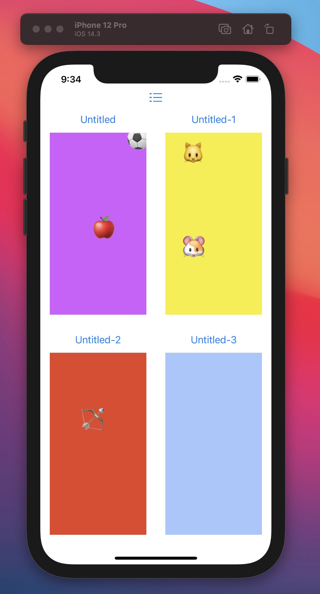
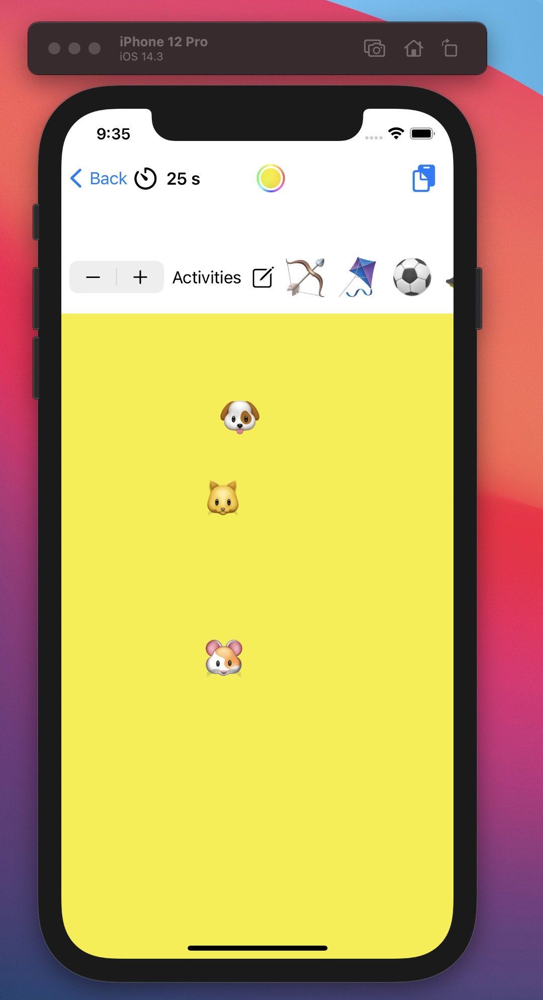

# ios2ndAssingment
2nd Assingment for the MobileiOSApplikationen Module @FHNW Fall 2020

Coded by Alejandro Garcia & Sandro Bütler

Impressions:
 

## Feature List

#### 01-TimeTracker

* Tracken Sie die Dauer, wie lange der Benutzer jeweils schon an einem Emoji Art Dokument gearbeitet hat
* Die laufende Bearbeitungsdauer wird dem Benutzer in der Dokument View angezeigt
* Verwenden Sie den TimerPublisher, um die Dauer im Sekundentakt zu aktualisieren
* Die Dauer wird zusammen mit dem Dokument gespeichert und mit jedem Öffnen weiter hochgezählt und beim Schliessen wieder gestoppt
* Setzen Sie die Darstellung des Timers in einer eigenen View um, die wiederum von der EmojiArtDocumentView präsentiert wird. Setzen Sie für den geteilten State die entsprechenden Property Wrappers ein

#### 02-EmojiArtWall

* Erstellen Sie einen neuen Screen, welcher alle Emoji Art Dokumente des Stores visuell in einem GridLayout darstellt.
* Der Absprung in die neue View erfolgt über den EmojiArtDocumentChooser.
* Über Tippen auf ein Grid Item gelangt der Benutzer in die entsprechende EmojiArtDocumentView.
* Über den Zurück Button in der EmojiArtDocumentView gelangt der Benutzer wieder auf die Emoji Art Wall zurück (sofern die Navigation über diese erfolgt ist)

#### 03-Hintergrundfarbe

* Bieten Sie dem Benutzer eine Möglichkeit, eine Hintergrundfarbe für die Emoji Art zu setzen
* Dazu wird dem Benutzer ein Form angezeigt, welches einen ColorPicker und einen Slider zur Wahl der Opacity enthält
* Wählen Sie eine geeignete Möglichkeit, um zum BackgroundColorForm zu navigieren
* Die Hintergrundfarbe wird ebenfalls gespeichert

#### ~~04-CoreData~~

* ~~Bauen Sie EmojiArt so um, dass jegliche Daten in Core Data persistiert werden~~
* ~~Emoji Paletten~~
* ~~Emoji Art Dokumente~~
* ~~Entfernen Sie jegliche Verwendungen von UserDefaults~~

#### 05-Testing

* Verwenden Sie das XCTest Framework. Erarbeiten Sie die Grundlagen im Selbstudium. Setzen Sie folgende Tests um:
* Unit Test (EmojiArtTest):
- testAddEmoji_whenTextIsEmpty_doesNothing
- testAddEmoji_whenTextSizeGreaterThan1_doesNothing
- testAddEmoji_whenInputValid_incrementsEmojiId
- Erweitern Sie EmojiArt gegebenenfalls um die Logik, die zur Erfüllung der Tests nötig ist
* UI Test (EmojiArtDocumentChooserTest):
- Edit wird gedrückt
- Der Name wird bearbeitet
- Done wird gedrückt
- Verify: Ist der Name des Dokuments angepasst?

### Branch Structure: feature/FEATURENAME

